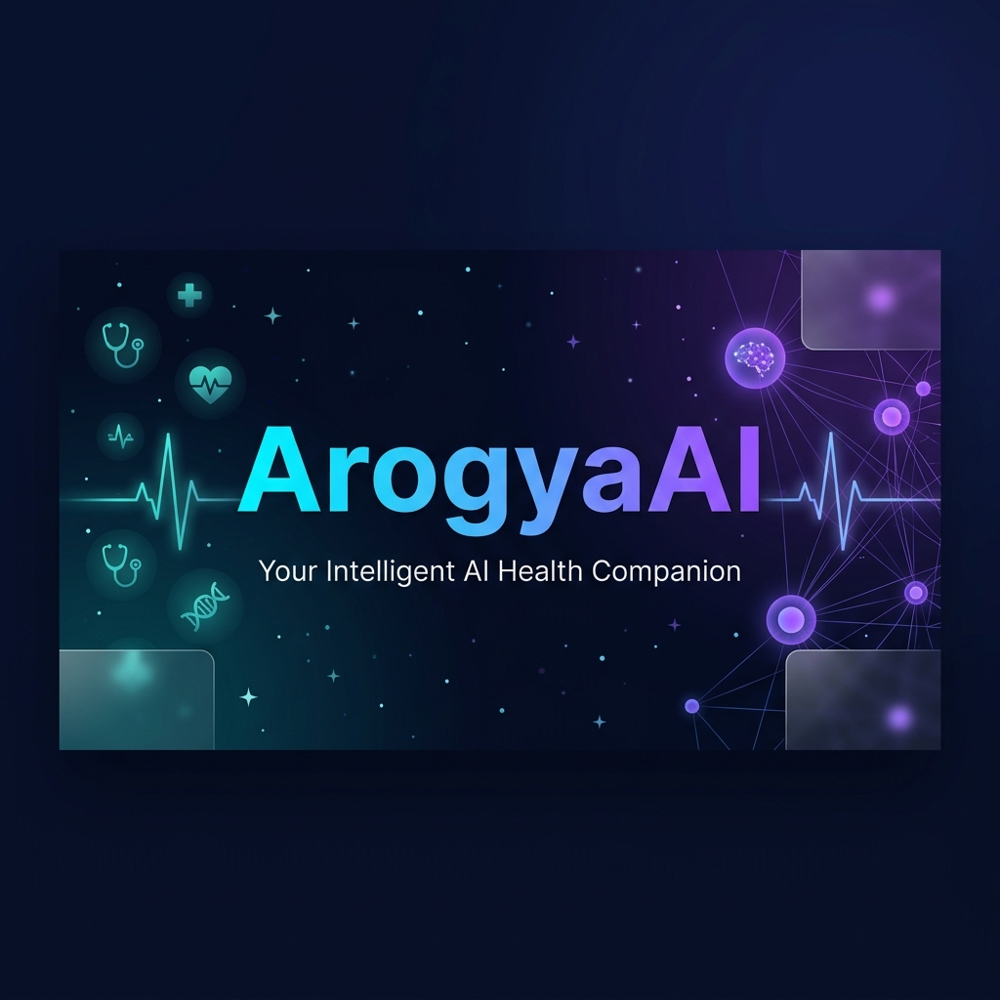

<div align="center">



<br/>
<br/>

<h1>
  
</h1>

<p align="center">
  <b>A full-stack, production-grade healthcare platform fusing Google Gemini AI with modern medical workflows.</b><br/>
  Emergency triage · Smart appointments · AI health records · Dual patient–doctor portals.
</p>

<br/>

<!-- Badges -->
<p align="center">
  <a href="https://nodejs.org/en"></a>
  <a href="https://react.dev"></a>
  <a href="https://mongodb.com"></a>
  
  <a href="https://razorpay.com"></a>
</p>

<p align="center">
  <a href="https://vite.dev/">
  <a href="https://tailwindcss.com/">
  <a href="https://expressjs.com/en/">
  <a href="https://cloudinary.com/">
  <a href="https://github.com/dhruvnayak001/ArogyaaAi/blob/main/LICENSE">
</p>

<br/>

<p align="center">
  <a href="https://arogyaaai-b5dd8.web.app"></a>
  &nbsp;
  <a href="#-api-reference"></a>
  &nbsp;
  <a href="../../issues"></a>
</p>

</div>

---

<div align="center">

## ✦ What is ArogyaAI? ✦

</div>

> **ArogyaAI** is not just another health app. It's an intelligent **AI-first healthcare ecosystem** — where patients get a 24/7 AI doctor in their pocket, and physicians get AI-powered tools to serve patients better. Built with a production-grade architecture, it handles everything from **voice-based symptom input** to **secure Razorpay payments**, from **OCR-powered medical record analysis** to **360° patient views** for doctors.

---

<div align="center">

## 🌟 Feature Highlights

</div>

<table>
<tr>
<td align="center" width="33%">
<br/>
<br/><br/>
<b>Gemini-Powered Chatbot</b><br/>
<sub>Context-aware healthcare conversations with multi-turn memory and model fallback chain (Flash → Pro → Flash-8B)</sub>
<br/><br/>
</td>
<td align="center" width="33%">
<br/>
<br/><br/>
<b>Real-Time Emergency Detection</b><br/>
<sub>AI analyzes reported symptoms + vitals and provides instant urgency classification with actionable next steps</sub>
<br/><br/>
</td>
<td align="center" width="33%">
<br/>
<br/><br/>
<b>Voice Input</b><br/>
<sub>Hands-free symptom input — speak naturally and let the AI understand your health concerns</sub>
<br/><br/>
</td>
</tr>
<tr>
<td align="center" width="33%">
<br/>
<br/><br/>
<b>Smart Health Records</b><br/>
<sub>Upload any PDF or image — Tesseract OCR extracts text, Gemini structures it with confidence scores, you review & confirm</sub>
<br/><br/>
</td>
<td align="center" width="33%">
<br/>
<br/><br/>
<b>Appointment Booking</b><br/>
<sub>Search doctors by specialty, book time slots, pay via Razorpay with HMAC-verified webhooks, get PDF invoices</sub>
<br/><br/>
</td>
<td align="center" width="33%">
<br/>
<br/><br/>
<b>360° Patient View</b><br/>
<sub>Doctors get AI-synthesized patient histories, clinical summaries generated by Gemini, and full timeline views</sub>
<br/><br/>
</td>
</tr>
</table>

---

<div align="center">

## 🏗️ System Architecture

</div>

```
╔══════════════════════════════════════════════════════════════════════════════╗
║                           🏥  ArogyaAI Platform                             ║
╠══════════════════════════════════════════════════════════════════════════════╣
║                                                                              ║
║   ┌──────────────────────────┐          ┌──────────────────────────────┐    ║
║   │   ⚛️  React 18 Frontend   │   JWT    │   🟢 Express.js Backend       │    ║
║   │   Vite + TailwindCSS     │ ◄──────► │   Node.js ≥ 18 + MongoDB     │    ║
║   │                          │  Cookie  │                              │    ║
║   │  🧑 Patient Dashboard    │          │  🔐 Auth API  (JWT + OTP)    │    ║
║   │  👨‍⚕️ Doctor Portal        │          │  💬 Chat API  (Gemini)       │    ║
║   │  💬 AI Chat Interface    │          │  📅 Appointments API         │    ║
║   │  📂 Health Records       │          │  🏥 Records + OCR API        │    ║
║   │  🚨 Emergency Page       │          │  💳 Payments API (Razorpay)  │    ║
║   │  📊 Analytics Dashboard  │          │  🚨 Emergency API            │    ║
║   └──────────────────────────┘          └──────────────┬───────────────┘    ║
║                                                         │                    ║
║          ┌──────────────┬──────────────────┬───────────┴────────────┐       ║
║          ▼              ▼                  ▼                        ▼       ║
║   ┌────────────┐  ┌──────────────┐  ┌───────────┐  ┌─────────────────┐    ║
║   │  🍃 MongoDB │  │  🤖 Gemini AI │  │ 💳 Razorpay│  │ ☁️  Cloudinary   │   ║
║   │    Atlas   │  │  Flash / Pro  │  │  Payments │  │  File Storage   │    ║
║   └────────────┘  └──────────────┘  └───────────┘  └─────────────────┘    ║
║                                                                              ║
║   ┌──────────────────────────────────────────────────────────────────────┐  ║
║   │                   📬 BullMQ Background Workers                       │  ║
║   │    📧 Email Worker · 🔔 Notification · 🤖 AI Summary · 💰 Refund    │  ║
║   └──────────────────────────────────────────────────────────────────────┘  ║
╚══════════════════════════════════════════════════════════════════════════════╝
```

---

<div align="center">

## 🛠️ Tech Stack

</div>

<table>
<tr>
<th align="center">🎨 Frontend</th>
<th align="center">⚙️ Backend</th>
<th align="center">🤖 AI / Data</th>
<th align="center">🔒 Security</th>
</tr>
<tr>
<td>

- ⚛️ **React 18** + Vite
- 🎨 **TailwindCSS 3**
- 🌊 **Framer Motion**
- 🐻 **Zustand** (state)
- 🔀 **React Router v6**
- 📝 **React Hook Form**
- 🌐 **Axios** (JWT interceptors)
- 🔔 **React Hot Toast**

</td>
<td>

- 🟢 **Node.js** ≥ 18
- 🚀 **Express 4**
- 🍃 **MongoDB** + Mongoose 8
- 📬 **BullMQ** + Redis
- 📧 **Nodemailer** (SMTP)
- ⏰ **node-cron** jobs
- 📝 **Winston** logging
- 💳 **Razorpay** payments

</td>
<td>

- 🤖 **Google Gemini API**
  - Flash / Pro fallback chain
- 🔍 **Tesseract.js** (OCR)
- 📄 **pdf-parse** (extraction)
- ☁️ **Cloudinary** storage
- 📊 Confidence scoring
- 🧠 Multi-turn chat memory

</td>
<td>

- 🛡️ **Helmet** (CSP / HSTS)
- 🔑 **JWT** rotating tokens
- 🚦 **Rate limiting** (tiered)
- 🧹 **Mongo sanitize**
- 🛑 **HPP** protection
- 🔐 **bcryptjs** hashing
- 🧾 **HMAC** payment verify
- 📋 Startup env validation

</td>
</tr>
</table>

---

<div align="center">

## ⚡ Quick Start

</div>

### Prerequisites

| Requirement | Version | Notes |
|-------------|---------|-------|
| **Node.js** | `≥ 18.0` | Required |
| **npm** | `≥ 9.0` | Required |
| **MongoDB** | Atlas or Local | Free tier works |
| **Google AI Studio** | API Key | Get at [aistudio.google.com](https://aistudio.google.com) |
| **Cloudinary** | Account | Free tier works |
| **Razorpay** | Test Account | Test mode supported |
| **Redis** | Optional | Enables distributed queue & rate limiting |

### Installation

```bash
# 1️⃣ Clone the repository
git clone https://github.com/your-username/ArogyaAI.git
cd ArogyaAI

# 2️⃣ Install server dependencies
cd server && npm install

# 3️⃣ Install client dependencies
cd ../client && npm install

# 4️⃣ Configure environment (see below)
cp server/.env.example server/.env
```

### Run in Development

```bash
# Terminal 1 — Backend (https://arogyaaai.onrender.com)
cd server && npm run dev

# Terminal 2 — Frontend (http://localhost:3000)
cd client && npm run dev
```

### Verify It's Running

```bash
curl https://arogyaaai.onrender.com/health
# {"success":true,"service":"ArogyaAI API","status":"healthy","version":"1.0.0"}

curl https://arogyaaai.onrender.com/readiness
# {"success":true,"status":"ready","checks":{"mongodb":{"status":"ok"},"gemini":{"status":"ok"}}}
```

---

<div align="center">

## 🔑 Environment Variables

</div>

> [!WARNING]
> The server **validates all variables at startup** and will **refuse to start** if any are missing, blank, or left as placeholders. This is intentional — a misconfigured server is more dangerous than no server.

Create `server/.env` from `server/.env.example`:

```env
# ─── Server ────────────────────────────────────────────────
PORT=5000
NODE_ENV=development

# ─── MongoDB Atlas ─────────────────────────────────────────
MONGODB_URI=mongodb+srv://<user>:<pass>@cluster.mongodb.net/arogyaai

# ─── JWT  (minimum 32 chars each) ──────────────────────────
JWT_ACCESS_SECRET=<64_char_random_secret>
JWT_REFRESH_SECRET=<64_char_random_secret>
JWT_ACCESS_EXPIRES_IN=15m
JWT_REFRESH_EXPIRES_IN=7d

# ─── Google Gemini AI ───────────────────────────────────────
GEMINI_API_KEY=<your_api_key>
GEMINI_MODEL=gemini-1.5-flash

# ─── Gmail SMTP ─────────────────────────────────────────────
EMAIL_HOST=smtp.gmail.com
EMAIL_PORT=587
EMAIL_USER=you@gmail.com
EMAIL_PASS=<Gmail App Password>
EMAIL_FROM=ArogyaAI <noreply@arogyaai.health>

# ─── Cloudinary ─────────────────────────────────────────────
CLOUDINARY_CLOUD_NAME=<cloud_name>
CLOUDINARY_API_KEY=<api_key>
CLOUDINARY_API_SECRET=<api_secret>

# ─── Razorpay ───────────────────────────────────────────────
RAZORPAY_KEY_ID=rzp_test_xxxxxxxxxxxx
RAZORPAY_KEY_SECRET=<secret>

# ─── Misc ───────────────────────────────────────────────────
CLIENT_URL=http://localhost:3000
COOKIE_SECRET=<32_char_random_secret>
REDIS_URL=redis://localhost:6379    # optional
```

---

<div align="center">

## 📁 Project Structure

</div>

```
ArogyaAI/
│
├── 📂 client/                        # ⚛️ React + Vite Frontend
│   └── src/
│       ├── 📂 api/                   # Axios instances & typed API helpers
│       ├── 📂 components/
│       │   ├── appointments/         # Booking, slot picker, appointment cards
│       │   ├── chat/                 # Chat bubble, voice input, message list
│       │   ├── doctor/               # Doctor card, schedule view
│       │   ├── guards/               # ProtectedRoute · DoctorRoute · PublicRoute
│       │   ├── navigation/           # Sidebar, navbar, breadcrumbs
│       │   ├── notifications/        # Reminder banner, notification item
│       │   ├── records/              # Upload zone, extraction modal, confirm flow
│       │   └── ui/                   # PageLoader, modals, badges, skeletons
│       ├── 📂 hooks/                 # useAuth, useChat, useDebounce, ...
│       ├── 📂 layouts/               # RootLayout · AuthLayout · DashboardLayout · DoctorLayout
│       ├── 📂 pages/
│       │   ├── auth/                 # Login · Register · ForgotPassword · ResetPassword · VerifyEmail
│       │   ├── appointments/         # AppointmentsPage · BookAppointmentPage
│       │   ├── chat/                 # ChatPage — AI assistant interface
│       │   ├── dashboard/            # DashboardPage — patient home
│       │   ├── doctor/               # DoctorDashboard · Appointments · Patients · PatientView360 · Summaries
│       │   ├── emergency/            # EmergencyPage — AI triage
│       │   ├── records/              # HealthRecordsPage — vault with search/filter
│       │   ├── profile/ settings/ notifications/
│       │   └── LandingPage.jsx       # Public marketing page
│       ├── 📂 store/                 # Zustand: authStore · chatStore · appointmentStore · extractionStore
│       └── 📂 utils/                 # normalizeMedicalExtraction, formatters, helpers
│
└── 📂 server/                        # 🟢 Node.js + Express Backend
    └── src/
        ├── 📂 config/                # db.js · gemini.js · logger.js · redis.js
        ├── 📂 controllers/           # HTTP layer — 9 controllers, delegates to services
        ├── 📂 middleware/            # auth · errorHandler · notFound · validate · upload
        ├── 📂 models/               # 7 Mongoose schemas with TTL indexes
        │   ├── User.model.js         # Patient + Doctor shared schema
        │   ├── Appointment.model.js  # Full lifecycle + payment sub-doc
        │   ├── ChatSession.model.js  # Multi-turn chat history
        │   ├── HealthRecord.model.js # OCR data + AI confidence scores
        │   ├── Notification.model.js # TTL: 30 days
        │   ├── Otp.model.js          # TTL: 10 minutes
        │   └── WebhookEvent.model.js # Idempotency store for Razorpay
        ├── 📂 queues/                # BullMQ definitions + 4 workers
        │   └── workers/              # email · notification · ai · refund
        ├── 📂 routes/                # 10 Express routers under /api/v1/*
        ├── 📂 services/              # 14 business-logic services
        │   ├── gemini.service.js     # 🤖 AI chat, summaries, model fallback
        │   ├── medicalAnalysis.service.js  # 📄 Full OCR → AI → confidence pipeline
        │   ├── payment.service.js    # 💳 Razorpay + PDF invoice generation
        │   ├── appointment.service.js
        │   ├── doctor.service.js     # Search, slots, patient 360°
        │   ├── cron.service.js       # ⏰ Reminder cron jobs
        │   ├── auth.service.js
        │   ├── record.service.js
        │   ├── ocr.service.js        # Tesseract.js wrapper
        │   ├── pdfParser.service.js
        │   ├── voice.service.js
        │   ├── chat.service.js
        │   ├── otp.service.js
        │   └── notification.service.js
        └── index.js                  # Express entry — security, routes, startup validation
```

---

<div align="center">

## 🔌 API Reference

</div>

Base URL: `https://arogyaaai.onrender.com/api/v1`

<details>
<summary><b>🔐 Auth</b> &nbsp;—&nbsp; <code>/api/v1/auth</code></summary>

<br/>

| Method | Endpoint | Description | 🔒 Auth |
|--------|----------|-------------|---------|
| `POST` | `/auth/register` | Register patient or doctor (sends OTP) | ❌ |
| `POST` | `/auth/login` | Login → sets JWT cookies | ❌ |
| `POST` | `/auth/logout` | Clear auth cookies | ✅ |
| `POST` | `/auth/refresh` | Rotate access token | ✅ |
| `POST` | `/auth/verify-email` | Verify OTP from email | ✅ |
| `POST` | `/auth/resend-otp` | Resend verification OTP | ✅ |
| `POST` | `/auth/forgot-password` | Send password reset email | ❌ |
| `POST` | `/auth/reset-password` | Reset password with token | ❌ |

</details>

<details>
<summary><b>💬 AI Chat</b> &nbsp;—&nbsp; <code>/api/v1/chat</code></summary>

<br/>

| Method | Endpoint | Description | 🔒 Auth |
|--------|----------|-------------|---------|
| `GET` | `/chat/sessions` | List all chat sessions | ✅ |
| `POST` | `/chat/sessions` | Create new session | ✅ |
| `GET` | `/chat/sessions/:id` | Get session + full message history | ✅ |
| `POST` | `/chat/sessions/:id/message` | Send message → get Gemini reply | ✅ |
| `DELETE` | `/chat/sessions/:id` | Delete a session | ✅ |

</details>

<details>
<summary><b>📅 Appointments</b> &nbsp;—&nbsp; <code>/api/v1/appointments</code></summary>

<br/>

| Method | Endpoint | Description | 🔒 Auth |
|--------|----------|-------------|---------|
| `POST` | `/appointments` | Book a new appointment | ✅ Patient |
| `GET` | `/appointments` | Patient's appointment list | ✅ Patient |
| `GET` | `/appointments/:id` | Appointment details | ✅ |
| `PATCH` | `/appointments/:id/cancel` | Cancel appointment | ✅ |
| `PATCH` | `/appointments/:id/reschedule` | Reschedule appointment | ✅ |
| `PATCH` | `/appointments/:id/complete` | Mark completed | ✅ Doctor |
| `GET` | `/appointments/doctor` | Doctor's appointment queue | ✅ Doctor |

</details>

<details>
<summary><b>🏥 Health Records</b> &nbsp;—&nbsp; <code>/api/v1/records</code></summary>

<br/>

| Method | Endpoint | Description | 🔒 Auth |
|--------|----------|-------------|---------|
| `POST` | `/records/extract-preview` | Upload → OCR + AI extract (no save yet) | ✅ |
| `POST` | `/records/confirm` | Confirm extracted data → save to DB | ✅ |
| `GET` | `/records` | List records (filter by type/search) | ✅ |
| `GET` | `/records/:id` | Single record + AI analysis | ✅ |
| `DELETE` | `/records/:id` | Delete record | ✅ |

</details>

<details>
<summary><b>💳 Payments</b> &nbsp;—&nbsp; <code>/api/v1/payments</code></summary>

<br/>

| Method | Endpoint | Description | 🔒 Auth |
|--------|----------|-------------|---------|
| `POST` | `/payments/create-order` | Create Razorpay order for appointment | ✅ |
| `POST` | `/payments/verify` | Verify HMAC signature → mark paid | ✅ |
| `POST` | `/payments/webhook` | Razorpay webhook (signature-verified) | Webhook |
| `POST` | `/payments/refund` | Initiate refund via BullMQ | ✅ |
| `GET` | `/payments/invoice/:id` | Download PDF invoice | ✅ |

</details>

<details>
<summary><b>👨‍⚕️ Doctors</b> &nbsp;—&nbsp; <code>/api/v1/doctors</code></summary>

<br/>

| Method | Endpoint | Description | 🔒 Auth |
|--------|----------|-------------|---------|
| `GET` | `/doctors` | Search & filter doctors | ✅ |
| `GET` | `/doctors/:id` | Doctor public profile | ✅ |
| `GET` | `/doctors/:id/slots` | Available time slots | ✅ |
| `GET` | `/doctors/dashboard` | Doctor stats & earnings | ✅ Doctor |
| `GET` | `/doctors/patients` | Doctor's patient list | ✅ Doctor |
| `GET` | `/doctors/patients/:id/360` | Patient 360° full view | ✅ Doctor |
| `GET` | `/doctors/summaries` | AI-generated clinical summaries | ✅ Doctor |

</details>

<details>
<summary><b>🚨 Emergency · 🔔 Notifications · 👤 Users · 🤖 AI</b></summary>

<br/>

| Module | Method | Endpoint | Description |
|--------|--------|----------|-------------|
| Emergency | `POST` | `/emergency/analyze` | AI symptom triage + urgency score |
| Notifications | `GET` | `/notifications` | List notifications |
| Notifications | `PATCH` | `/notifications/:id/read` | Mark as read |
| Notifications | `PATCH` | `/notifications/read-all` | Mark all as read |
| Users | `GET` | `/users/me` | Current user profile |
| Users | `PUT` | `/users/profile` | Update profile |
| Users | `PUT` | `/users/change-password` | Change password |
| AI | `POST` | `/ai/brief` | Generate clinical brief from record |
| AI | `POST` | `/ai/extract-preview` | AI extraction preview |

</details>

---

<div align="center">

## 🤖 AI Pipeline — Medical Record Extraction

</div>

```
   Upload (PDF / Image)
          │
          ▼
  ┌───────────────────┐
  │  Text Extraction   │
  │                   │
  │  PDF → pdf-parse  │   ──→  No text found?  ──→  OCR Fallback (Tesseract.js)
  │  Image → Tesseract│
  └────────┬──────────┘
           │
           ▼
  ┌───────────────────────────────────────────┐
  │  Gemini AI Structured Extraction           │
  │                                           │
  │  Returns: { field: { value, confidence } }│
  │  Fields: diagnoses, medications, labs,    │
  │  vitals, dates, doctor, patient, summary  │
  └────────────────────┬──────────────────────┘
                       │
                       ▼
         ┌─────────────────────────┐
         │  Confidence Scoring     │
         │                         │
         │  ≥ 0.8  ✅ High         │
         │  ≥ 0.6  ⚠️  Medium      │
         │  < 0.6  🔴 Needs Review │
         └────────────┬────────────┘
                      │
                      ▼
         User Reviews in Confirmation Modal
         (Low-confidence fields highlighted)
                      │
                      ▼
         POST /records/confirm → MongoDB
                      │
                      ▼
         Async: Gemini generates Doctor Summary
         (clinical brief for physician review)
```

---

<div align="center">

## 🔒 Security Architecture

</div>

| Layer | Mechanism | Details |
|-------|-----------|---------|
| 🌐 **Transport** | HSTS | 2-year max-age, includeSubDomains, preload-eligible |
| 🛡️ **Headers** | Helmet + CSP | `frame-ancestors 'none'`, strict content security |
| 🚦 **Rate Limits** | Tiered limiters | Global 300/15min · Auth 20/15min · AI 20/15min · Upload 10/15min · Payment 60/15min |
| 🔑 **Auth** | JWT rotation | 15-min access tokens + 7-day refresh in HTTP-only signed cookies |
| 🔢 **OTP** | Hashed + TTL | bcrypt-hashed OTPs with 10-min MongoDB TTL index + attempt counting |
| 🧹 **Injection** | Mongo sanitize | `express-mongo-sanitize` on every request |
| 🛑 **Pollution** | HPP | Parameter pollution prevention on every request |
| 💳 **Payments** | HMAC-SHA256 | Webhook signature verification + orderId idempotency (replay prevention) |
| 📤 **Uploads** | MIME + size | Type validation + 20MB per-file via Multer |
| 🌍 **CORS** | Strict allowlist | `null` origin explicitly rejected; dev ports excluded in production |
| 🔐 **Secrets** | Startup validation | Server refuses to start with missing/placeholder/too-short secrets |

---

<div align="center">

## ⏰ Cron Jobs

</div>

Two automated reminder jobs run after MongoDB connects:

| Job | Interval | Trigger Window | Action |
|-----|----------|----------------|--------|
| **24-hour reminder** | Every hour | Appointments 24–25 hours away | Email + in-app notification |
| **1-hour reminder** | Every 15 min | Appointments 60–75 minutes away | Email + in-app notification |

Duplicate sends are prevented via `reminderSent24h` / `reminderSent1h` boolean flags on the Appointment document.

---

<div align="center">

## 🧪 Testing & Linting

</div>

```bash
# Run all tests
cd server && npm test

# Watch mode for TDD
npm run test:watch

# Coverage report
npm run test:coverage

# Lint check
npm run lint

# Auto-fix lint errors
npm run lint:fix
```

---

<div align="center">

## 🚀 Deployment Checklist

</div>

Before going live, verify:

- [ ] ✅ All `.env` variables filled — **zero** placeholders remaining
- [ ] ✅ `NODE_ENV=production`
- [ ] ✅ `REDIS_URL` configured for reliable BullMQ queues & distributed rate-limiting
- [ ] ✅ MongoDB Atlas IP allow-list set for your server IPs
- [ ] ✅ Cloudinary signed uploads enabled
- [ ] ✅ Razorpay webhook URL registered + secret configured
- [ ] ✅ SMTP tested with a live Gmail App Password
- [ ] ✅ `/health` and `/readiness` probe endpoints verified

> **Pro tip:** ArogyaAI is Kubernetes-ready out of the box — use `/health` for liveness probes and `/readiness` for readiness probes. The graceful shutdown handler drains all BullMQ workers before process exit.

---

<div align="center">

## 🤝 Contributing

</div>

Welcome contributions! Here's how to get started:

```bash
# Fork the repo, then:
git checkout -b feat/your-amazing-feature
git commit -m "feat: add your amazing feature"
git push origin feat/your-amazing-feature
# Open a Pull Request 🎉
```

Please ensure `npm run lint` passes and existing `npm test` tests are green before submitting.

---

<div align="center">

## 📄 License

This project is licensed under the **MIT License**.

---

<br/>


### Built with ❤️ by **Dhruv Nayak**

*🩺 ArogyaAI — Bridging AI and Healthcare for a Healthier Tomorrow*

<br/>

<div align="center">

[](https://github.com/dhruvnayak001)
[](https://www.linkedin.com/in/dhruv-nayak-32a9682a8)

</div>

<br/>

⭐ **Star this repo if you found it useful!** ⭐

</div>
